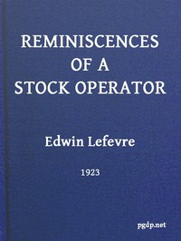

# Reminiscences of a Stock Operator <kbd>60979</kbd>

## Authors

 - Lefevre, Edwin <small>(1871 - 1943)</small>

## Subjects

 - Investments
 - New York Stock Exchange
 - Speculation

## Download

 - https://www.gutenberg.org/files/60979/60979-h.zip
 - https://www.gutenberg.org/files/60979/60979-0.txt
 - https://www.gutenberg.org/cache/epub/60979/pg60979.cover.medium.jpg
 - https://www.gutenberg.org/files/60979/60979-h/60979-h.htm
 - https://www.gutenberg.org/ebooks/60979.html.images
 - https://www.gutenberg.org/ebooks/60979.kindle.images
 - https://www.gutenberg.org/ebooks/60979.epub.images
 - https://www.gutenberg.org/ebooks/60979.rdf

## Book Shelves

