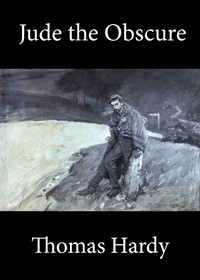

# Jude the Obscure <kbd>153</kbd>

## Authors

 - Hardy, Thomas <small>(1840 - 1928)</small>

## Subjects

 - Adultery -- Fiction
 - Children -- Death -- Fiction
 - Didactic fiction
 - Illegitimate children -- Fiction
 - Love stories
 - Stonemasons -- Fiction
 - Unmarried couples -- Fiction
 - Wessex (England) -- Fiction

## Download

 - https://www.gutenberg.org/files/153/153.zip
 - https://www.gutenberg.org/files/153/153-8.zip
 - https://www.gutenberg.org/cache/epub/153/pg153.cover.medium.jpg
 - https://www.gutenberg.org/files/153/153-h/153-h.htm
 - https://www.gutenberg.org/files/153/153-0.txt
 - https://www.gutenberg.org/files/153/153-8.txt
 - https://www.gutenberg.org/ebooks/153.html.images
 - https://www.gutenberg.org/ebooks/153.kindle.images
 - https://www.gutenberg.org/ebooks/153.rdf
 - https://www.gutenberg.org/ebooks/153.epub.images

## Book Shelves

 - Banned Books from Anne Haight's list
