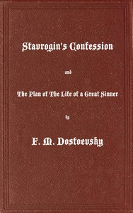

# Stavrogin's Confession and The Plan of The Life of a Great Sinner: With Introductory and Explanatory Notes <kbd>57050</kbd>

## Authors

 - Dostoyevsky, Fyodor <small>(1821 - 1881)</small>

## Subjects

 - Dostoyevsky, Fyodor, 1821-1881 -- Translations into English
 - Russia -- Social life and customs -- Fiction

## Download

 - https://www.gutenberg.org/files/57050/57050-h.zip
 - https://www.gutenberg.org/cache/epub/57050/pg57050.cover.small.jpg
 - https://www.gutenberg.org/ebooks/57050.html.images
 - https://www.gutenberg.org/files/57050/57050-h/57050-h.htm
 - https://www.gutenberg.org/files/57050/57050-0.txt
 - https://www.gutenberg.org/ebooks/57050.rdf
 - https://www.gutenberg.org/ebooks/57050.epub.images
 - https://www.gutenberg.org/ebooks/57050.kindle.images

## Book Shelves

