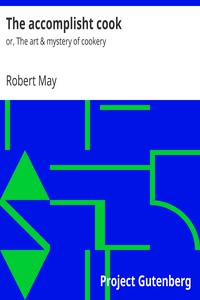

# The accomplisht cook: or, The art & mystery of cookery <kbd>22790</kbd>

## Authors

 - May, Robert <small>(1588 - null)</small>

## Subjects

 - Cooking, English -- Early works to 1800

## Download

 - https://www.gutenberg.org/files/22790/22790-h/22790-h.htm
 - https://www.gutenberg.org/files/22790/22790-h/cook1.html
 - https://www.gutenberg.org/files/22790/22790.zip
 - https://www.gutenberg.org/files/22790/22790.txt
 - https://www.gutenberg.org/files/22790/22790-8.txt
 - https://www.gutenberg.org/cache/epub/22790/pg22790.cover.medium.jpg
 - https://www.gutenberg.org/ebooks/22790.txt.utf-8
 - https://www.gutenberg.org/ebooks/22790.epub.images
 - https://www.gutenberg.org/ebooks/22790.rdf
 - https://www.gutenberg.org/ebooks/22790.kindle.images

## Book Shelves

 - Cookbooks and Cooking
