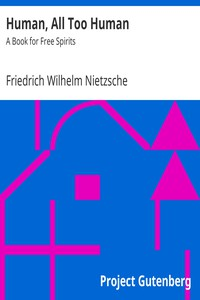

# Human, All Too Human: A Book for Free Spirits <kbd>38145</kbd>

## Authors

 - Nietzsche, Friedrich Wilhelm <small>(1844 - 1900)</small>

## Subjects

 - Human beings

## Download

 - https://www.gutenberg.org/files/38145/38145-h/38145-h.htm
 - https://www.gutenberg.org/files/38145/38145-8.txt
 - https://www.gutenberg.org/files/38145/38145-8.zip
 - https://www.gutenberg.org/cache/epub/38145/pg38145.cover.small.jpg
 - https://www.gutenberg.org/files/38145/38145.txt
 - https://www.gutenberg.org/ebooks/38145.html.images
 - https://www.gutenberg.org/ebooks/38145.txt.utf-8
 - https://www.gutenberg.org/ebooks/38145.epub.images
 - https://www.gutenberg.org/ebooks/38145.kindle.images
 - https://www.gutenberg.org/ebooks/38145.rdf

## Book Shelves

