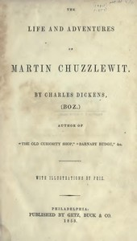

# Martin Chuzzlewit <kbd>968</kbd>

## Authors

 - Dickens, Charles <small>(1812 - 1870)</small>

## Subjects

 - Adventure stories
 - Avarice -- Fiction
 - Bildungsromans
 - Black humor
 - British -- United States -- Fiction
 - England -- Fiction
 - Grandfathers -- Fiction
 - Satire
 - United States -- Description and travel -- Fiction
 - Young men -- Fiction

## Download

 - https://www.gutenberg.org/files/968/968-h/968-h.htm
 - https://www.gutenberg.org/files/968/968-0.zip
 - https://www.gutenberg.org/files/968/968.zip
 - https://www.gutenberg.org/cache/epub/968/pg968.cover.small.jpg
 - https://www.gutenberg.org/ebooks/968.html.images
 - https://www.gutenberg.org/ebooks/968.kindle.images
 - https://www.gutenberg.org/ebooks/968.rdf
 - https://www.gutenberg.org/ebooks/968.epub.images

## Book Shelves

 - Best Books Ever Listings
