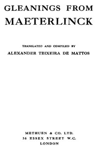

# Gleanings from Maeterlinck <kbd>67625</kbd>

## Authors

 - Maeterlinck, Maurice <small>(1862 - 1949)</small>

## Subjects

 - Belgian essays (French) -- Translations into English
 - Death

## Download

 - https://www.gutenberg.org/ebooks/67625.rdf
 - https://www.gutenberg.org/ebooks/67625.txt.utf-8
 - https://www.gutenberg.org/ebooks/67625.kindle.images
 - https://www.gutenberg.org/ebooks/67625.epub.images
 - https://www.gutenberg.org/cache/epub/67625/pg67625.cover.small.jpg
 - https://www.gutenberg.org/ebooks/67625.html.images
 - https://www.gutenberg.org/files/67625/67625-0.zip
 - https://www.gutenberg.org/files/67625/67625-h.zip
 - https://www.gutenberg.org/files/67625/67625-0.txt

## Book Shelves

