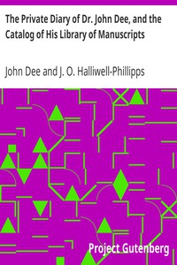

# The Private Diary of Dr. John Dee, and the Catalog of His Library of Manuscripts <kbd>19553</kbd>

## Authors

 - Dee, John <small>(1527 - 1608)</small>

## Subjects

 - Dee, John, 1527-1608
 - Dee, John, 1527-1608 -- Diaries
 - Manuscripts, English -- England -- Cambridge -- Catalogs
 - Manuscripts, English -- England -- Oxford -- Catalogs

## Download

 - https://www.gutenberg.org/files/19553/19553-h/19553-h.htm
 - https://www.gutenberg.org/cache/epub/19553/pg19553.cover.small.jpg
 - https://www.gutenberg.org/files/19553/19553-h.zip
 - https://www.gutenberg.org/files/19553/19553-8.txt
 - https://www.gutenberg.org/ebooks/19553.html.images
 - https://www.gutenberg.org/files/19553/19553-0.txt
 - https://www.gutenberg.org/ebooks/19553.rdf
 - https://www.gutenberg.org/ebooks/19553.epub.images
 - https://www.gutenberg.org/ebooks/19553.kindle.images

## Book Shelves

