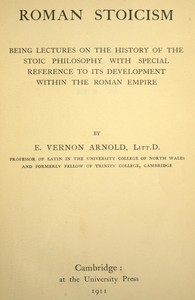

# Roman Stoicism: being lectures on the history of the Stoic philosophy with special reference to its development within the Roman Empire <kbd>64488</kbd>

## Authors

 - Arnold, Edward Vernon <small>(1857 - 1926)</small>

## Subjects

 - Stoics

## Download

 - https://www.gutenberg.org/cache/epub/64488/pg64488.cover.small.jpg
 - https://www.gutenberg.org/files/64488/64488-h.zip
 - https://www.gutenberg.org/files/64488/64488-0.txt
 - https://www.gutenberg.org/files/64488/64488-h/64488-h.htm
 - https://www.gutenberg.org/ebooks/64488.html.images
 - https://www.gutenberg.org/ebooks/64488.rdf
 - https://www.gutenberg.org/ebooks/64488.kindle.images
 - https://www.gutenberg.org/ebooks/64488.epub.images

## Book Shelves

