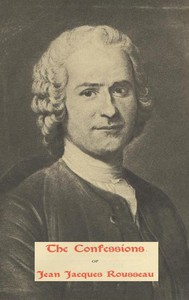

# The Confessions of Jean Jacques Rousseau — Complete <kbd>3913</kbd>

## Authors

 - Rousseau, Jean-Jacques <small>(1712 - 1778)</small>

## Subjects

 - Authors, French -- 18th century -- Biography
 - Rousseau, Jean-Jacques, 1712-1778

## Download

 - https://www.gutenberg.org/files/3913/3913.txt
 - https://www.gutenberg.org/cache/epub/3913/pg3913.cover.small.jpg
 - https://www.gutenberg.org/files/3913/3913-8.zip
 - https://www.gutenberg.org/files/3913/3913.zip
 - https://www.gutenberg.org/files/3913/3913-h/3913-h.htm
 - https://www.gutenberg.org/ebooks/3913.html.images
 - https://www.gutenberg.org/files/3913/3913-0.txt
 - https://www.gutenberg.org/ebooks/3913.kindle.images
 - https://www.gutenberg.org/ebooks/3913.rdf
 - https://www.gutenberg.org/ebooks/3913.epub.images

## Book Shelves

