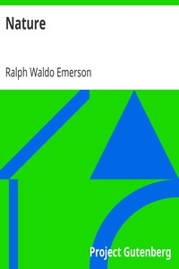

# Nature <kbd>29433</kbd>

## Authors

 - Emerson, Ralph Waldo <small>(1803 - 1882)</small>

## Subjects

 - Nature
 - Philosophy, American

## Download

 - https://www.gutenberg.org/files/29433/29433-h.zip
 - https://www.gutenberg.org/files/29433/29433-h/29433-h.htm
 - https://www.gutenberg.org/cache/epub/29433/pg29433.cover.medium.jpg
 - https://www.gutenberg.org/files/29433/29433-8.txt
 - https://www.gutenberg.org/ebooks/29433.html.images
 - https://www.gutenberg.org/files/29433/29433.txt
 - https://www.gutenberg.org/ebooks/29433.kindle.images
 - https://www.gutenberg.org/ebooks/29433.txt.utf-8
 - https://www.gutenberg.org/ebooks/29433.epub.images
 - https://www.gutenberg.org/ebooks/29433.rdf

## Book Shelves

