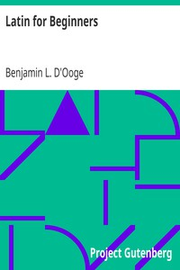

# Latin for Beginners <kbd>18251</kbd>

## Authors

 - D'Ooge, Benjamin L. (Benjamin Leonard) <small>(1860 - 1940)</small>

## Subjects

 - Latin language -- Grammar -- Problems, exercises, etc.

## Download

 - https://www.gutenberg.org/cache/epub/18251/pg18251.cover.small.jpg
 - https://www.gutenberg.org/files/18251/18251-0.zip
 - https://www.gutenberg.org/files/18251/18251-h/18251-h.htm
 - https://www.gutenberg.org/ebooks/18251.txt.utf-8
 - https://www.gutenberg.org/files/18251/18251-0.txt
 - https://www.gutenberg.org/ebooks/18251.rdf
 - https://www.gutenberg.org/ebooks/18251.epub.images
 - https://www.gutenberg.org/ebooks/18251.kindle.images

## Book Shelves

 - Language Education
