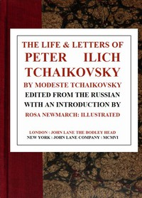

# The Life & Letters of Peter Ilich Tchaikovsky <kbd>45259</kbd>

## Authors

 - Chaikovskii, Modest <small>(1850 - 1916)</small>

## Subjects

 - Composers -- Russia -- Biography
 - Tchaikovsky, Peter Ilich, 1840-1893

## Download

 - https://www.gutenberg.org/files/45259/45259-8.zip
 - https://www.gutenberg.org/files/45259/45259-h/45259-h.htm
 - https://www.gutenberg.org/files/45259/45259-0.txt
 - https://www.gutenberg.org/cache/epub/45259/pg45259.cover.small.jpg
 - https://www.gutenberg.org/files/45259/45259-8.txt
 - https://www.gutenberg.org/ebooks/45259.html.images
 - https://www.gutenberg.org/ebooks/45259.kindle.images
 - https://www.gutenberg.org/ebooks/45259.rdf
 - https://www.gutenberg.org/ebooks/45259.epub.images

## Book Shelves

