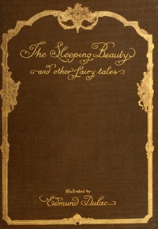

# The Sleeping Beauty and other fairy tales from the Old French <kbd>51275</kbd>

## Authors

 - Quiller-Couch, Arthur <small>(1863 - 1944)</small>
 - Perrault, Charles <small>(1628 - 1703)</small>

## Subjects

 - Fairy tales
 - Fairy tales -- France
 - Folklore -- France

## Download

 - https://www.gutenberg.org/files/51275/51275-8.txt
 - https://www.gutenberg.org/files/51275/51275-h/51275-h.htm
 - https://www.gutenberg.org/files/51275/51275-h.zip
 - https://www.gutenberg.org/cache/epub/51275/pg51275.cover.small.jpg
 - https://www.gutenberg.org/ebooks/51275.html.images
 - https://www.gutenberg.org/ebooks/51275.txt.utf-8
 - https://www.gutenberg.org/ebooks/51275.rdf
 - https://www.gutenberg.org/ebooks/51275.epub.images
 - https://www.gutenberg.org/ebooks/51275.kindle.images

## Book Shelves

