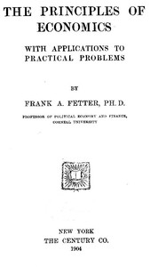

# The Principles of Economics, with Applications to Practical Problems <kbd>40077</kbd>

## Authors

 - Fetter, Frank A. (Frank Albert) <small>(1863 - 1949)</small>

## Subjects

 - Economics

## Download

 - https://www.gutenberg.org/files/40077/40077-8.zip
 - https://www.gutenberg.org/files/40077/40077.zip
 - https://www.gutenberg.org/cache/epub/40077/pg40077.cover.medium.jpg
 - https://www.gutenberg.org/ebooks/40077.html.images
 - https://www.gutenberg.org/files/40077/40077-h/40077-h.htm
 - https://www.gutenberg.org/files/40077/40077-8.txt
 - https://www.gutenberg.org/ebooks/40077.rdf
 - https://www.gutenberg.org/ebooks/40077.txt.utf-8
 - https://www.gutenberg.org/ebooks/40077.kindle.images
 - https://www.gutenberg.org/ebooks/40077.epub.images

## Book Shelves

