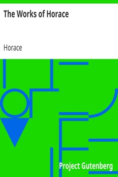

# The Works of Horace <kbd>14020</kbd>

## Authors

 - Horace <small>(-65 - -8)</small>

## Subjects

 - Horace -- Translations into English
 - Latin poetry -- Translations into English

## Download

 - https://www.gutenberg.org/files/14020/14020-h.zip
 - https://www.gutenberg.org/files/14020/14020.zip
 - https://www.gutenberg.org/cache/epub/14020/pg14020.cover.medium.jpg
 - https://www.gutenberg.org/ebooks/14020.html.images
 - https://www.gutenberg.org/ebooks/14020.txt.utf-8
 - https://www.gutenberg.org/ebooks/14020.epub.images
 - https://www.gutenberg.org/ebooks/14020.rdf
 - https://www.gutenberg.org/ebooks/14020.kindle.images

## Book Shelves

 - Classical Antiquity
 - Poetry
