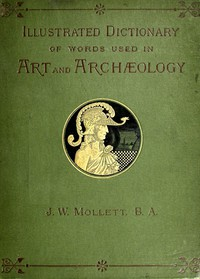

# An Illustrated Dictionary of Words used in Art and Archaeology: Explaining terms frequently used in works on architecture, arms, bronzes, Christian art, colour, costume, decoration, devices, emblems, heraldry, lace, personal ornaments, pottery, painting, sculpture, &c., with their derivations. <kbd>67629</kbd>

## Authors

 - Mollett, John W. (John William) <small>(null - null)</small>

## Subjects

 - Archaeology -- Dictionaries
 - Art -- Dictionaries

## Download

 - https://www.gutenberg.org/ebooks/67629.txt.utf-8
 - https://www.gutenberg.org/cache/epub/67629/pg67629.cover.medium.jpg
 - https://www.gutenberg.org/ebooks/67629.rdf
 - https://www.gutenberg.org/files/67629/67629-0.zip
 - https://www.gutenberg.org/ebooks/67629.epub.images
 - https://www.gutenberg.org/ebooks/67629.kindle.images
 - https://www.gutenberg.org/files/67629/67629-h/67629-h.htm
 - https://www.gutenberg.org/files/67629/67629-0.txt

## Book Shelves

