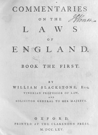

# Commentaries on the Laws of England, Book the First <kbd>30802</kbd>

## Authors

 - Blackstone, William, Sir <small>(1723 - 1780)</small>

## Subjects

 - Law -- England
 - Law -- England -- History

## Download

 - https://www.gutenberg.org/files/30802/30802.zip
 - https://www.gutenberg.org/cache/epub/30802/pg30802.cover.small.jpg
 - https://www.gutenberg.org/files/30802/30802-h.zip
 - https://www.gutenberg.org/files/30802/30802-8.txt
 - https://www.gutenberg.org/files/30802/30802-h/30802-h.htm
 - https://www.gutenberg.org/ebooks/30802.html.images
 - https://www.gutenberg.org/ebooks/30802.txt.utf-8
 - https://www.gutenberg.org/ebooks/30802.epub.images
 - https://www.gutenberg.org/ebooks/30802.rdf
 - https://www.gutenberg.org/ebooks/30802.kindle.images

## Book Shelves

 - British Law
