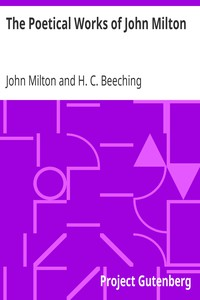

# The Poetical Works of John Milton <kbd>1745</kbd>

## Authors

 - Milton, John <small>(1608 - 1674)</small>

## Subjects

 - English poetry

## Download

 - https://www.gutenberg.org/files/1745/1745.zip
 - https://www.gutenberg.org/files/1745/1745.txt
 - https://www.gutenberg.org/cache/epub/1745/pg1745.cover.medium.jpg
 - https://www.gutenberg.org/ebooks/1745.html.images
 - https://www.gutenberg.org/files/1745/1745-h/1745-h.htm
 - https://www.gutenberg.org/ebooks/1745.rdf
 - https://www.gutenberg.org/ebooks/1745.epub.images
 - https://www.gutenberg.org/ebooks/1745.kindle.images
 - https://www.gutenberg.org/ebooks/1745.txt.utf-8

## Book Shelves

 - Harvard Classics
