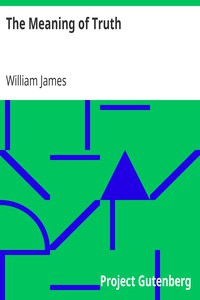

# The Meaning of Truth <kbd>5117</kbd>

## Authors

 - James, William <small>(1842 - 1910)</small>

## Subjects

 - Pragmatism
 - Reality
 - Truth

## Download

 - https://www.gutenberg.org/files/5117/5117.zip
 - https://www.gutenberg.org/cache/epub/5117/pg5117.cover.small.jpg
 - https://www.gutenberg.org/files/5117/5117.txt
 - https://www.gutenberg.org/ebooks/5117.html.images
 - https://www.gutenberg.org/files/5117/5117-h/5117-h.htm
 - https://www.gutenberg.org/ebooks/5117.kindle.images
 - https://www.gutenberg.org/ebooks/5117.rdf
 - https://www.gutenberg.org/ebooks/5117.txt.utf-8
 - https://www.gutenberg.org/ebooks/5117.epub.images

## Book Shelves

