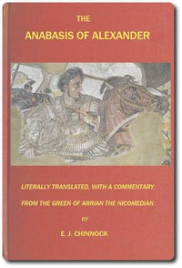

# The Anabasis of Alexander: or, The History of the Wars and Conquests of Alexander the Great <kbd>46976</kbd>

## Authors

 - Arrian <small>(null - null)</small>

## Subjects

 - Alexander, the Great, 356 B.C.-323 B.C.
 - India -- History -- To 324 B.C.
 - Iran -- History -- To 640

## Download

 - https://www.gutenberg.org/files/46976/46976-h.zip
 - https://www.gutenberg.org/cache/epub/46976/pg46976.cover.small.jpg
 - https://www.gutenberg.org/files/46976/46976-0.txt
 - https://www.gutenberg.org/ebooks/46976.html.images
 - https://www.gutenberg.org/ebooks/46976.epub.images
 - https://www.gutenberg.org/ebooks/46976.rdf
 - https://www.gutenberg.org/ebooks/46976.kindle.images

## Book Shelves

