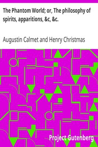

# The Phantom World; or, The philosophy of spirits, apparitions, &c, &c. <kbd>29412</kbd>

## Authors

 - Calmet, Augustin <small>(1672 - 1757)</small>

## Subjects

 - Apparitions
 - Demonology
 - Spirits

## Download

 - https://www.gutenberg.org/files/29412/29412.txt
 - https://www.gutenberg.org/cache/epub/29412/pg29412.cover.medium.jpg
 - https://www.gutenberg.org/files/29412/29412-8.txt
 - https://www.gutenberg.org/files/29412/29412.zip
 - https://www.gutenberg.org/files/29412/29412-h.zip
 - https://www.gutenberg.org/ebooks/29412.html.images
 - https://www.gutenberg.org/ebooks/29412.txt.utf-8
 - https://www.gutenberg.org/ebooks/29412.epub.images
 - https://www.gutenberg.org/ebooks/29412.kindle.images
 - https://www.gutenberg.org/ebooks/29412.rdf

## Book Shelves

