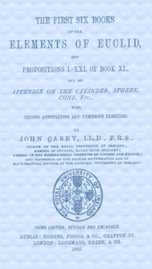

# The First Six Books of the Elements of Euclid <kbd>21076</kbd>

## Authors

 - Euclid <small>(null - null)</small>
 - Casey, John <small>(1820 - 1891)</small>

## Subjects

 - Euclid's Elements
 - Mathematics, Greek

## Download

 - https://www.gutenberg.org/files/21076/21076-h.zip
 - https://www.gutenberg.org/ebooks/21076.html.images
 - https://www.gutenberg.org/files/21076/21076-page-images/p023.png
 - https://www.gutenberg.org/cache/epub/21076/pg21076.cover.medium.jpg
 - https://www.gutenberg.org/files/21076/21076-t/21076-t.tex
 - https://www.gutenberg.org/files/21076/21076-pdf.pdf
 - https://www.gutenberg.org/ebooks/21076.kindle.images
 - https://www.gutenberg.org/ebooks/21076.rdf
 - https://www.gutenberg.org/ebooks/21076.epub.images

## Book Shelves

 - Mathematics
