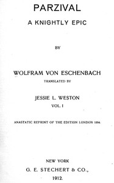

# Parzival: A Knightly Epic (vol. 1 of 2) <kbd>47297</kbd>

## Authors

 - Wolfram, von Eschenbach, active 12th century <small>(null - null)</small>

## Subjects

 - Perceval (Legendary character) -- Romances

## Download

 - https://www.gutenberg.org/cache/epub/47297/pg47297.cover.medium.jpg
 - https://www.gutenberg.org/files/47297/47297-h/47297-h.htm
 - https://www.gutenberg.org/files/47297/47297-8.txt
 - https://www.gutenberg.org/files/47297/47297-8.zip
 - https://www.gutenberg.org/ebooks/47297.html.images
 - https://www.gutenberg.org/ebooks/47297.epub.images
 - https://www.gutenberg.org/ebooks/47297.rdf
 - https://www.gutenberg.org/ebooks/47297.kindle.images
 - https://www.gutenberg.org/ebooks/47297.txt.utf-8

## Book Shelves

