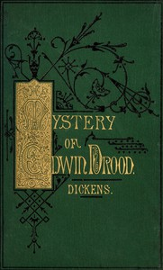

# The Mystery of Edwin Drood <kbd>564</kbd>

## Authors

 - Dickens, Charles <small>(1812 - 1870)</small>

## Subjects

 - Cathedrals -- Fiction
 - Choral conductors -- Fiction
 - England -- Fiction
 - Missing persons -- Fiction
 - Mystery fiction
 - Psychological fiction
 - Separation (Psychology) -- Fiction
 - Triangles (Interpersonal relations) -- Fiction

## Download

 - https://www.gutenberg.org/files/564/564-h.zip
 - https://www.gutenberg.org/cache/epub/564/pg564.cover.medium.jpg
 - https://www.gutenberg.org/ebooks/564.txt.utf-8
 - https://www.gutenberg.org/files/564/564-h/564-h.htm
 - https://www.gutenberg.org/files/564/564-0.txt
 - https://www.gutenberg.org/ebooks/564.kindle.images
 - https://www.gutenberg.org/ebooks/564.rdf
 - https://www.gutenberg.org/ebooks/564.epub.images

## Book Shelves

 - Mystery Fiction
