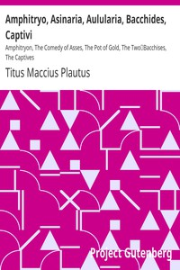

# Amphitryo, Asinaria, Aulularia, Bacchides, Captivi: Amphitryon, The Comedy of Asses, The Pot of Gold, The Two; Bacchises, The Captives <kbd>16564</kbd>

## Authors

 - Plautus, Titus Maccius <small>(-254 - -184)</small>

## Subjects

 - Latin drama (Comedy)
 - Latin drama (Comedy) -- Translations into English

## Download

 - https://www.gutenberg.org/files/16564/16564.txt
 - https://www.gutenberg.org/cache/epub/16564/pg16564.cover.small.jpg
 - https://www.gutenberg.org/files/16564/16564.zip
 - https://www.gutenberg.org/files/16564/16564-h.zip
 - https://www.gutenberg.org/files/16564/16564-0.zip
 - https://www.gutenberg.org/ebooks/16564.html.images
 - https://www.gutenberg.org/ebooks/16564.epub.images
 - https://www.gutenberg.org/ebooks/16564.rdf
 - https://www.gutenberg.org/ebooks/16564.kindle.images

## Book Shelves

