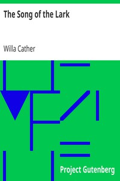

# The Song of the Lark <kbd>44</kbd>

## Authors

 - Cather, Willa <small>(1873 - 1947)</small>

## Subjects

 - Bildungsromans
 - Chicago (Ill.) -- Fiction
 - Children of clergy -- Fiction
 - Colorado -- Fiction
 - Musical fiction
 - Opera -- Fiction
 - Swedish Americans -- Fiction
 - Women singers -- Fiction
 - Young women -- Fiction

## Download

 - https://www.gutenberg.org/files/44/44-0.txt
 - https://www.gutenberg.org/cache/epub/44/pg44.cover.medium.jpg
 - https://www.gutenberg.org/files/44/44-h.zip
 - https://www.gutenberg.org/files/44/44.zip
 - https://www.gutenberg.org/ebooks/44.html.images
 - https://www.gutenberg.org/files/44/44.txt
 - https://www.gutenberg.org/ebooks/44.kindle.images
 - https://www.gutenberg.org/ebooks/44.rdf
 - https://www.gutenberg.org/ebooks/44.epub.images

## Book Shelves

 - Opera
