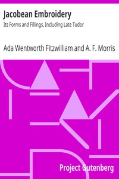

# Jacobean Embroidery: Its Forms and Fillings, Including Late Tudor <kbd>18971</kbd>

## Authors

 - Hands, A. F. Morris <small>(null - null)</small>
 - Fitzwilliam, Ada Wentworth <small>(null - null)</small>

## Subjects

 - Embroidery

## Download

 - https://www.gutenberg.org/files/18971/18971-h.zip
 - https://www.gutenberg.org/cache/epub/18971/pg18971.cover.small.jpg
 - https://www.gutenberg.org/files/18971/18971-h/18971-h.htm
 - https://www.gutenberg.org/files/18971/18971.txt
 - https://www.gutenberg.org/files/18971/18971-8.txt
 - https://www.gutenberg.org/ebooks/18971.html.images
 - https://www.gutenberg.org/ebooks/18971.rdf
 - https://www.gutenberg.org/ebooks/18971.epub.images
 - https://www.gutenberg.org/ebooks/18971.kindle.images
 - https://www.gutenberg.org/ebooks/18971.txt.utf-8

## Book Shelves

 - Crafts
