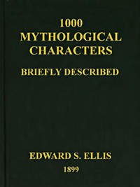

# 1000 Mythological Characters Briefly Described: Adapted to Private Schools, High Schools and Academies <kbd>42474</kbd>

## Authors

 - Ellis, Edward Sylvester <small>(1840 - 1916)</small>

## Subjects

 - Mythology -- Dictionaries

## Download

 - https://www.gutenberg.org/files/42474/42474.txt
 - https://www.gutenberg.org/files/42474/42474-h.zip
 - https://www.gutenberg.org/files/42474/42474-h/42474-h.htm
 - https://www.gutenberg.org/files/42474/42474-8.txt
 - https://www.gutenberg.org/cache/epub/42474/pg42474.cover.small.jpg
 - https://www.gutenberg.org/ebooks/42474.html.images
 - https://www.gutenberg.org/files/42474/42474-0.txt
 - https://www.gutenberg.org/ebooks/42474.kindle.images
 - https://www.gutenberg.org/ebooks/42474.rdf
 - https://www.gutenberg.org/ebooks/42474.epub.images

## Book Shelves

