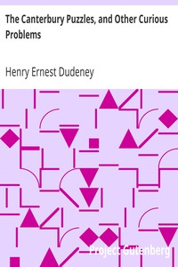

# The Canterbury Puzzles, and Other Curious Problems <kbd>27635</kbd>

## Authors

 - Dudeney, Henry Ernest <small>(1857 - 1930)</small>

## Subjects

 - Puzzles
 - Riddles

## Download

 - https://www.gutenberg.org/files/27635/27635.zip
 - https://www.gutenberg.org/files/27635/27635-8.txt
 - https://www.gutenberg.org/cache/epub/27635/pg27635.cover.small.jpg
 - https://www.gutenberg.org/ebooks/27635.html.images
 - https://www.gutenberg.org/files/27635/27635-h/27635-h.htm
 - https://www.gutenberg.org/ebooks/27635.txt.utf-8
 - https://www.gutenberg.org/ebooks/27635.rdf
 - https://www.gutenberg.org/ebooks/27635.kindle.images
 - https://www.gutenberg.org/ebooks/27635.epub.images

## Book Shelves

