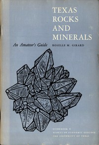

# Texas Rocks and Minerals: An Amateur's Guide <kbd>52839</kbd>

## Authors

 - Girard, Roselle M. <small>(1918 - null)</small>

## Subjects

 - Mineralogy -- Texas
 - Petrology
 - Petrology -- Texas

## Download

 - https://www.gutenberg.org/cache/epub/52839/pg52839.cover.medium.jpg
 - https://www.gutenberg.org/files/52839/52839-0.txt
 - https://www.gutenberg.org/files/52839/52839-h.zip
 - https://www.gutenberg.org/files/52839/52839-h/52839-h.htm
 - https://www.gutenberg.org/ebooks/52839.html.images
 - https://www.gutenberg.org/ebooks/52839.epub.images
 - https://www.gutenberg.org/ebooks/52839.rdf
 - https://www.gutenberg.org/ebooks/52839.kindle.images

## Book Shelves

