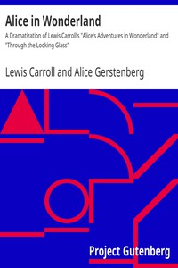

# Alice in Wonderland: A Dramatization of Lewis Carroll's "Alice's Adventures in Wonderland" and "Through the Looking Glass" <kbd>35688</kbd>

## Authors

 - Carroll, Lewis <small>(1832 - 1898)</small>
 - Gerstenberg, Alice <small>(1885 - 1972)</small>

## Subjects

 - Children's plays
 - Fantasy drama

## Download

 - https://www.gutenberg.org/files/35688/35688-h.zip
 - https://www.gutenberg.org/files/35688/35688.zip
 - https://www.gutenberg.org/files/35688/35688-h/35688-h.htm
 - https://www.gutenberg.org/cache/epub/35688/pg35688.cover.medium.jpg
 - https://www.gutenberg.org/ebooks/35688.html.images
 - https://www.gutenberg.org/ebooks/35688.txt.utf-8
 - https://www.gutenberg.org/ebooks/35688.epub.images
 - https://www.gutenberg.org/ebooks/35688.rdf
 - https://www.gutenberg.org/ebooks/35688.kindle.images

## Book Shelves

