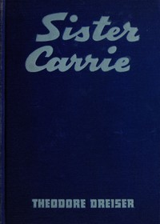

# Sister Carrie: A Novel <kbd>233</kbd>

## Authors

 - Dreiser, Theodore <small>(1871 - 1945)</small>

## Subjects

 - Chicago (Ill.) -- Fiction
 - Didactic fiction
 - Mistresses -- Fiction
 - New York (N.Y.) -- Fiction
 - Young women -- Fiction

## Download

 - https://www.gutenberg.org/cache/epub/233/pg233.cover.medium.jpg
 - https://www.gutenberg.org/files/233/233-h.zip
 - https://www.gutenberg.org/files/233/233.txt
 - https://www.gutenberg.org/ebooks/233.html.images
 - https://www.gutenberg.org/files/233/233-0.txt
 - https://www.gutenberg.org/files/233/233-h/233-h.htm
 - https://www.gutenberg.org/ebooks/233.kindle.images
 - https://www.gutenberg.org/ebooks/233.rdf
 - https://www.gutenberg.org/ebooks/233.epub.images

## Book Shelves

