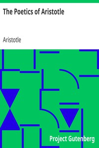

# The Poetics of Aristotle <kbd>1974</kbd>

## Authors

 - Aristotle <small>(-384 - -322)</small>

## Subjects

 - Aesthetics -- Early works to 1800
 - Poetry -- Early works to 1800

## Download

 - https://www.gutenberg.org/files/1974/1974-h.zip
 - https://www.gutenberg.org/files/1974/1974.zip
 - https://www.gutenberg.org/cache/epub/1974/pg1974.cover.medium.jpg
 - https://www.gutenberg.org/files/1974/1974-h/1974-h.htm
 - https://www.gutenberg.org/ebooks/1974.html.images
 - https://www.gutenberg.org/ebooks/1974.rdf
 - https://www.gutenberg.org/ebooks/1974.epub.images
 - https://www.gutenberg.org/ebooks/1974.kindle.images
 - https://www.gutenberg.org/ebooks/1974.txt.utf-8

## Book Shelves

 - Classical Antiquity
 - Philosophy
