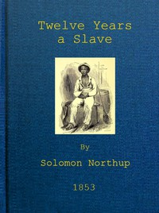

# Twelve Years a Slave: Narrative of Solomon Northup, a Citizen of New-York, Kidnapped in Washington City in 1841, and Rescued in 1853, from a Cotton Plantation near the Red River in Louisiana <kbd>45631</kbd>

## Authors

 - Northup, Solomon <small>(1808 - null)</small>

## Subjects

 - African Americans -- Biography
 - Northup, Solomon, 1808-1863?
 - Plantation life -- Louisiana -- History -- 19th century
 - Slavery -- Louisiana -- History -- 19th century
 - Slaves -- United States -- Biography
 - Slaves' writings, American

## Download

 - https://www.gutenberg.org/files/45631/45631-8.txt
 - https://www.gutenberg.org/files/45631/45631.zip
 - https://www.gutenberg.org/files/45631/45631-h.zip
 - https://www.gutenberg.org/cache/epub/45631/pg45631.cover.medium.jpg
 - https://www.gutenberg.org/files/45631/45631.txt
 - https://www.gutenberg.org/ebooks/45631.html.images
 - https://www.gutenberg.org/ebooks/45631.kindle.images
 - https://www.gutenberg.org/ebooks/45631.rdf
 - https://www.gutenberg.org/ebooks/45631.txt.utf-8
 - https://www.gutenberg.org/ebooks/45631.epub.images

## Book Shelves

