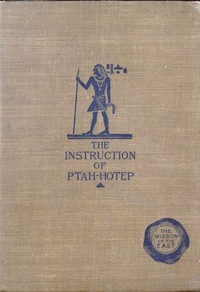

# The Instruction of Ptah-Hotep and the Instruction of Ke'Gemni: The Oldest Books in the World <kbd>30508</kbd>

## Authors

 - Ptahhotep <small>(null - null)</small>
 - Kagemna <small>(null - null)</small>

## Subjects

 - Conduct of life -- Early works to 1800
 - Maxims -- Early works to 1800

## Download

 - https://www.gutenberg.org/files/30508/30508-h.zip
 - https://www.gutenberg.org/cache/epub/30508/pg30508.cover.small.jpg
 - https://www.gutenberg.org/files/30508/30508-8.zip
 - https://www.gutenberg.org/files/30508/30508-h/30508-h.htm
 - https://www.gutenberg.org/ebooks/30508.html.images
 - https://www.gutenberg.org/files/30508/30508.txt
 - https://www.gutenberg.org/ebooks/30508.txt.utf-8
 - https://www.gutenberg.org/ebooks/30508.epub.images
 - https://www.gutenberg.org/ebooks/30508.rdf
 - https://www.gutenberg.org/ebooks/30508.kindle.images

## Book Shelves

