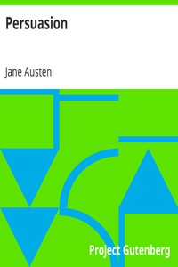

# Persuasion <kbd>105</kbd>

## Authors

 - Austen, Jane <small>(1775 - 1817)</small>

## Subjects

 - Dysfunctional families -- Fiction
 - England -- Social life and customs -- 19th century -- Fiction
 - First loves -- Fiction
 - Love stories
 - Motherless families -- Fiction
 - Psychological fiction
 - Regency fiction
 - Rejection (Psychology) -- Fiction
 - Ship captains -- Fiction
 - Young women -- Fiction

## Download

 - https://www.gutenberg.org/files/105/105.zip
 - https://www.gutenberg.org/files/105/105-h/105-h.htm
 - https://www.gutenberg.org/files/105/105.txt
 - https://www.gutenberg.org/cache/epub/105/pg105.cover.medium.jpg
 - https://www.gutenberg.org/files/105/105-8.txt
 - https://www.gutenberg.org/ebooks/105.html.images
 - https://www.gutenberg.org/ebooks/105.kindle.images
 - https://www.gutenberg.org/ebooks/105.txt.utf-8
 - https://www.gutenberg.org/ebooks/105.rdf
 - https://www.gutenberg.org/ebooks/105.epub.images

## Book Shelves

