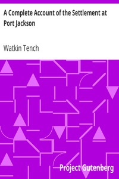

# A Complete Account of the Settlement at Port Jackson <kbd>3534</kbd>

## Authors

 - Tench, Watkin <small>(null - 1833)</small>

## Subjects

 - New South Wales -- Description and travel -- Early works to 1800
 - New South Wales -- Discovery and exploration -- Early works to 1800
 - Penal colonies -- Australia -- New South Wales
 - Port Jackson (N.S.W.) -- History

## Download

 - https://www.gutenberg.org/files/3534/3534.txt
 - https://www.gutenberg.org/files/3534/3534.zip
 - https://www.gutenberg.org/cache/epub/3534/pg3534.cover.medium.jpg
 - https://www.gutenberg.org/ebooks/3534.html.images
 - https://www.gutenberg.org/files/3534/3534-h/3534-h.htm
 - https://www.gutenberg.org/ebooks/3534.txt.utf-8
 - https://www.gutenberg.org/ebooks/3534.kindle.images
 - https://www.gutenberg.org/ebooks/3534.epub.images
 - https://www.gutenberg.org/ebooks/3534.rdf

## Book Shelves

 - Australia
