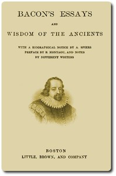

# Bacon's Essays, and Wisdom of the Ancients <kbd>56463</kbd>

## Authors

 - Bacon, Francis <small>(1561 - 1626)</small>

## Subjects

 - Bacon, Francis, 1561-1626
 - English essays -- Early modern, 1500-1700
 - Mythology, Classical

## Download

 - https://www.gutenberg.org/files/56463/56463-h.zip
 - https://www.gutenberg.org/files/56463/56463-0.txt
 - https://www.gutenberg.org/files/56463/56463-0.zip
 - https://www.gutenberg.org/cache/epub/56463/pg56463.cover.small.jpg
 - https://www.gutenberg.org/ebooks/56463.html.images
 - https://www.gutenberg.org/ebooks/56463.rdf
 - https://www.gutenberg.org/ebooks/56463.epub.images
 - https://www.gutenberg.org/ebooks/56463.kindle.images

## Book Shelves

