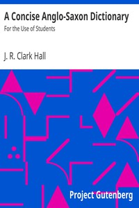

# A Concise Anglo-Saxon Dictionary: For the Use of Students <kbd>31543</kbd>

## Authors

 - Hall, J. R. Clark (John R. Clark) <small>(1855 - null)</small>

## Subjects

 - English language -- Old English, ca. 450-1100 -- Dictionaries

## Download

 - https://www.gutenberg.org/files/31543/31543-0.zip
 - https://www.gutenberg.org/files/31543/31543-h/31543-h.htm
 - https://www.gutenberg.org/cache/epub/31543/pg31543.cover.medium.jpg
 - https://www.gutenberg.org/ebooks/31543.html.images
 - https://www.gutenberg.org/ebooks/31543.epub.images
 - https://www.gutenberg.org/ebooks/31543.kindle.images
 - https://www.gutenberg.org/ebooks/31543.rdf

## Book Shelves

