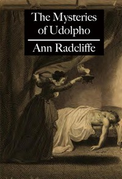

# The Mysteries of Udolpho <kbd>3268</kbd>

## Authors

 - Radcliffe, Ann Ward <small>(1764 - 1823)</small>

## Subjects

 - Castles -- Fiction
 - Gothic fiction
 - Guardian and ward -- Fiction
 - Horror tales
 - Inheritance and succession -- Fiction
 - Italy -- Fiction
 - Orphans -- Fiction
 - Young women -- Fiction

## Download

 - https://www.gutenberg.org/cache/epub/3268/pg3268.cover.small.jpg
 - https://www.gutenberg.org/files/3268/3268.txt
 - https://www.gutenberg.org/files/3268/3268-h.zip
 - https://www.gutenberg.org/files/3268/3268-h/3268-h.htm
 - https://www.gutenberg.org/files/3268/3268-0.txt
 - https://www.gutenberg.org/ebooks/3268.html.images
 - https://www.gutenberg.org/ebooks/3268.kindle.images
 - https://www.gutenberg.org/ebooks/3268.epub.images
 - https://www.gutenberg.org/ebooks/3268.rdf

## Book Shelves

 - Gothic Fiction
 - Italy
