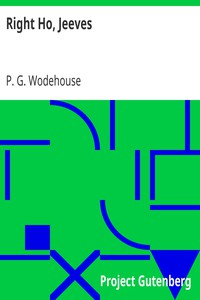

# Right Ho, Jeeves <kbd>10554</kbd>

## Authors

 - Wodehouse, P. G. (Pelham Grenville) <small>(1881 - 1975)</small>

## Subjects

 - England -- Fiction
 - Humorous stories
 - Jeeves (Fictitious character) -- Fiction
 - Single men -- Fiction
 - Valets -- Fiction
 - Wooster, Bertie (Fictitious character) -- Fiction

## Download

 - https://www.gutenberg.org/files/10554/10554.zip
 - https://www.gutenberg.org/files/10554/10554.txt
 - https://www.gutenberg.org/files/10554/10554-h.zip
 - https://www.gutenberg.org/cache/epub/10554/pg10554.cover.medium.jpg
 - https://www.gutenberg.org/ebooks/10554.html.images
 - https://www.gutenberg.org/files/10554/10554-8.txt
 - https://www.gutenberg.org/ebooks/10554.txt.utf-8
 - https://www.gutenberg.org/ebooks/10554.epub.images
 - https://www.gutenberg.org/ebooks/10554.rdf
 - https://www.gutenberg.org/ebooks/10554.kindle.images

## Book Shelves

 - Humor
