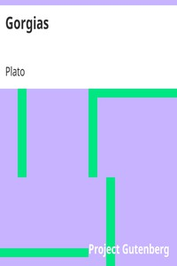

# Gorgias <kbd>1672</kbd>

## Authors

 - Plato <small>(-428 - -348)</small>

## Subjects

 - Classical literature
 - Ethics -- Early works to 1800
 - Political science -- Early works to 1800

## Download

 - https://www.gutenberg.org/files/1672/1672-h.zip
 - https://www.gutenberg.org/files/1672/1672.txt
 - https://www.gutenberg.org/cache/epub/1672/pg1672.cover.small.jpg
 - https://www.gutenberg.org/ebooks/1672.html.images
 - https://www.gutenberg.org/ebooks/1672.rdf
 - https://www.gutenberg.org/ebooks/1672.epub.images
 - https://www.gutenberg.org/ebooks/1672.kindle.images
 - https://www.gutenberg.org/ebooks/1672.txt.utf-8

## Book Shelves

