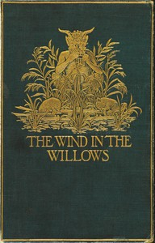

# The Wind in the Willows <kbd>289</kbd>

## Authors

 - Grahame, Kenneth <small>(1859 - 1932)</small>

## Subjects

 - Animals -- Fiction
 - Country life -- Fiction
 - England -- Fiction
 - Fantasy fiction
 - Friendship -- Fiction
 - Humorous stories
 - Pastoral fiction
 - River life -- Fiction

## Download

 - https://www.gutenberg.org/ebooks/289.html.images
 - https://www.gutenberg.org/files/289/289-0.zip
 - https://www.gutenberg.org/files/289/289-h/289-h.htm
 - https://www.gutenberg.org/files/289/289-0.txt
 - https://www.gutenberg.org/cache/epub/289/pg289.cover.small.jpg
 - https://www.gutenberg.org/ebooks/289.kindle.images
 - https://www.gutenberg.org/ebooks/289.rdf
 - https://www.gutenberg.org/ebooks/289.epub.images

## Book Shelves

 - Best Books Ever Listings
 - Children's Literature
