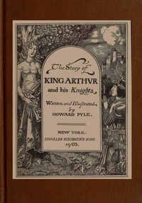

# The Story of King Arthur and his Knights <kbd>60184</kbd>

## Authors

 - Pyle, Howard <small>(1853 - 1911)</small>

## Subjects

 - Arthur, King -- Legends
 - Arthurian romances -- Adaptations
 - Folklore -- England
 - Knights and knighthood -- Folklore

## Download

 - https://www.gutenberg.org/files/60184/60184-0.zip
 - https://www.gutenberg.org/files/60184/60184-0.txt
 - https://www.gutenberg.org/cache/epub/60184/pg60184.cover.small.jpg
 - https://www.gutenberg.org/ebooks/60184.html.images
 - https://www.gutenberg.org/files/60184/60184-h/60184-h.htm
 - https://www.gutenberg.org/ebooks/60184.kindle.images
 - https://www.gutenberg.org/ebooks/60184.rdf
 - https://www.gutenberg.org/ebooks/60184.epub.images

## Book Shelves

