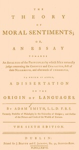

# The Theory of Moral Sentiments: Or, an Essay Towards an Analysis of the Principles by Which Men Naturally Judge Concerning the Conduct and Character, First of Their Neighbours, and Afterwards of Themselves. to Which Is Added, a Dissertation on the Origin of Languages. <kbd>67363</kbd>

## Authors

 - Smith, Adam <small>(1723 - 1790)</small>

## Subjects

 - Ethics -- Early works to 1800
 - Language and languages -- Early works to 1800

## Download

 - https://www.gutenberg.org/files/67363/67363-h.zip
 - https://www.gutenberg.org/cache/epub/67363/pg67363.cover.small.jpg
 - https://www.gutenberg.org/ebooks/67363.rdf
 - https://www.gutenberg.org/ebooks/67363.kindle.images
 - https://www.gutenberg.org/ebooks/67363.epub.images
 - https://www.gutenberg.org/ebooks/67363.txt.utf-8
 - https://www.gutenberg.org/ebooks/67363.html.images
 - https://www.gutenberg.org/files/67363/67363-0.txt

## Book Shelves

