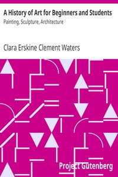

# A History of Art for Beginners and Students: Painting, Sculpture, Architecture <kbd>24726</kbd>

## Authors

 - Waters, Clara Erskine Clement <small>(1834 - 1916)</small>

## Subjects

 - Art -- History

## Download

 - https://www.gutenberg.org/files/24726/24726-h/24726-h.htm
 - https://www.gutenberg.org/files/24726/24726.zip
 - https://www.gutenberg.org/files/24726/24726-8.txt
 - https://www.gutenberg.org/cache/epub/24726/pg24726.cover.small.jpg
 - https://www.gutenberg.org/ebooks/24726.html.images
 - https://www.gutenberg.org/files/24726/24726.txt
 - https://www.gutenberg.org/ebooks/24726.kindle.images
 - https://www.gutenberg.org/ebooks/24726.rdf
 - https://www.gutenberg.org/ebooks/24726.epub.images
 - https://www.gutenberg.org/ebooks/24726.txt.utf-8

## Book Shelves

 - Art
