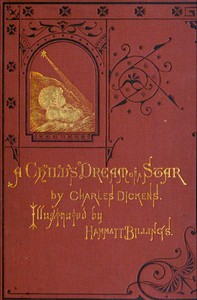

# A Child's Dream of a Star <kbd>42232</kbd>

## Authors

 - Dickens, Charles <small>(1812 - 1870)</small>

## Subjects

 - Children -- Death -- Juvenile fiction
 - Children and death -- Juvenile fiction
 - Christian life -- Juvenile fiction
 - Grief -- Juvenile fiction
 - Heaven -- Juvenile fiction
 - Short stories

## Download

 - https://www.gutenberg.org/files/42232/42232-0.txt
 - https://www.gutenberg.org/files/42232/42232.zip
 - https://www.gutenberg.org/files/42232/42232-h/42232-h.htm
 - https://www.gutenberg.org/ebooks/42232.html.images
 - https://www.gutenberg.org/cache/epub/42232/pg42232.cover.medium.jpg
 - https://www.gutenberg.org/files/42232/42232.txt
 - https://www.gutenberg.org/ebooks/42232.kindle.images
 - https://www.gutenberg.org/ebooks/42232.rdf
 - https://www.gutenberg.org/ebooks/42232.epub.images

## Book Shelves

