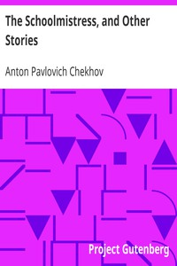

# The Schoolmistress, and Other Stories <kbd>1732</kbd>

## Authors

 - Chekhov, Anton Pavlovich <small>(1860 - 1904)</small>

## Subjects

 - Chekhov, Anton Pavlovich, 1860-1904 -- Translations into English
 - Russia -- Social life and customs -- Fiction
 - Short stories

## Download

 - https://www.gutenberg.org/files/1732/1732.zip
 - https://www.gutenberg.org/files/1732/1732-h/1732-h.htm
 - https://www.gutenberg.org/files/1732/1732-0.zip
 - https://www.gutenberg.org/cache/epub/1732/pg1732.cover.medium.jpg
 - https://www.gutenberg.org/ebooks/1732.html.images
 - https://www.gutenberg.org/ebooks/1732.epub.images
 - https://www.gutenberg.org/ebooks/1732.rdf
 - https://www.gutenberg.org/ebooks/1732.kindle.images

## Book Shelves

