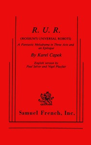

# R.U.R. (Rossum's Universal Robots): A Fantastic Melodrama in Three Acts and an Epilogue <kbd>59112</kbd>

## Authors

 - Čapek, Karel <small>(1890 - 1938)</small>

## Subjects

 - Czech drama -- Translations into English
 - Robots -- Drama
 - Science fiction plays

## Download

 - https://www.gutenberg.org/files/59112/59112-0.txt
 - https://www.gutenberg.org/files/59112/59112-0.zip
 - https://www.gutenberg.org/files/59112/59112-h.zip
 - https://www.gutenberg.org/cache/epub/59112/pg59112.cover.small.jpg
 - https://www.gutenberg.org/ebooks/59112.html.images
 - https://www.gutenberg.org/ebooks/59112.rdf
 - https://www.gutenberg.org/ebooks/59112.epub.images
 - https://www.gutenberg.org/ebooks/59112.kindle.images

## Book Shelves

